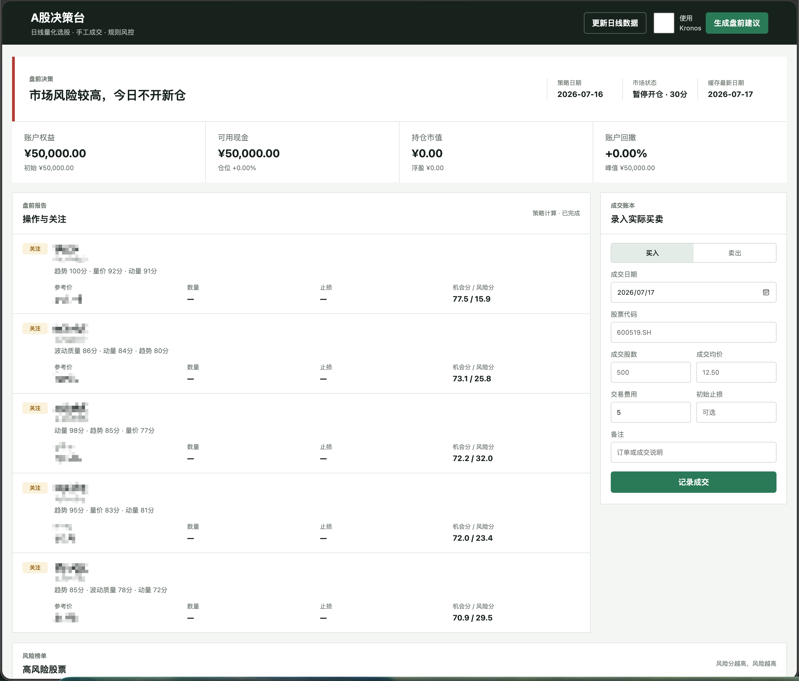

# A股决策台

A股日线量化研究与持仓记录工具。项目从结构化行情和财务数字计算市场状态、机会分、风险分、仓位上限及退出条件，通过 Web 页面展示结果并记录用户手工成交。

它不会连接券商，也不会自动下单。项目输出是确定性算法的计算结果，作用类似金融计算器，**不是荐股软件，不构成任何投资建议**。



## 能做什么

- 增量缓存沪深300成分股、指数日线、换手率、估值、行业和结构化财务数字。
- 计算趋势、动量、量价、波动、估值和财务质量因子。
- 每日输出机会榜、独立风险榜和市场开仓状态。
- 根据账户权益、ATR和仓位限制计算计划数量与止损价。
- 根据实际持仓计算持有、减仓或退出条件。
- 使用 SQLite 保存行情、因子快照、风险记录、持仓和成交。
- 可选使用本地 Kronos 预测；没有模型时完整运行纯多因子版本。

## 快速启动

要求 Python 3.11 或兼容版本。

```bash
git clone <repository-url>
cd stock_assistant

python -m venv .venv
source .venv/bin/activate
python -m pip install -r requirements.txt

# 首次下载历史数据，后续只做增量更新
python -m stockapp.cli sync

# 生成纯多因子盘前报告
python -m stockapp.cli recommend

# 启动 Web 页面
python run.py
```

浏览器打开 <http://127.0.0.1:5001>。

首次同步默认从 `2018-01-01` 开始，耗时取决于 BaoStock。财务数字按报告期单独更新：

```bash
python -m stockapp.cli sync-financials --year 2026 --quarter 2
```

### 可选 Kronos

基础版本不安装 Torch，也不要求任何模型文件。需要 Kronos 时安装附加依赖并配置本地路径：

```bash
python -m pip install -r requirements-kronos.txt

export KRONOS_ENABLED=1
export KRONOS_SOURCE=/path/to/Kronos
export KRONOS_MODEL=/path/to/Kronos-model
export KRONOS_TOKENIZER=/path/to/Kronos-tokenizer

python -m stockapp.cli recommend --kronos
```

未配置模型、路径不存在或显式设置 `KRONOS_ENABLED=0` 时，Web 不显示 Kronos 开关；即使传入 `--kronos`，程序也会退回纯多因子算法，不会阻止报告生成。

### 配置项

| 环境变量 | 默认值 | 说明 |
|---|---|---|
| `STOCK_ASSISTANT_DATA` | `./data` | 数据目录 |
| `STOCK_ASSISTANT_DB` | `./data/stocks.db` | SQLite 文件 |
| `STOCK_HISTORY_START` | `2018-01-01` | 首次同步起始日期 |
| `STOCK_INITIAL_CAPITAL` | `50000` | 初始账户资金 |
| `HOST` | `127.0.0.1` | Web 监听地址 |
| `PORT` | `5001` | Web 监听端口 |
| `KRONOS_ENABLED` | `auto` | `auto`、`1` 或 `0` |
| `KRONOS_SOURCE` | 自动检测 | Kronos 源码目录 |
| `KRONOS_MODEL` | 自动检测 | 模型目录 |
| `KRONOS_TOKENIZER` | 自动检测 | tokenizer 目录 |

## 算法原理

算法仅使用结构化数字，不读取新闻、舆情、公告正文或财报文本。

### 数据截面

- 股票池为当前沪深300成分股。
- 每只股票读取最多600根日K，少于120根时跳过；120根是 MA120 可计算的最低边界。
- 所有股票统一使用沪深300指数的最新完整交易日，避免数据源分批发布造成截面错位。
- 财务数字只使用 `publish_date <= 决策日` 的记录，避免使用尚未披露的数据。
- 停牌、ST或关键指标不足的股票不参与当日评分。

### 机会分

纯多因子版本将以下权重归一化为100分：

| 因子组 | 权重 | 内容 |
|---|---:|---|
| 趋势 | 20% | MA20/60/120、均线斜率、MACD、20日突破 |
| 动量 | 15% | 20日相对强弱、RSI、KDJ |
| 量价 | 20% | 成交量、成交额、OBV、MFI、涨跌成交量比 |
| 波动质量 | 10% | ATR、年化波动率、下行波动率、Beta |
| 估值 | 10% | PE、PB、PS、PCF行业百分位 |
| 财务质量 | 15% | ROE、净利率、利润增长、现金流、负债率 |

启用 Kronos 时，基础机会分占90%，Kronos未来5日预测分占10%。模型仅处理基础排名靠前的候选；单只股票推理失败时，该股票自动保留纯因子分。

### 风险分

风险分独立计算，不是机会分的反数。范围为0–100，**越高表示数字特征呈现的风险越高**。

| 风险组 | 权重 | 内容 |
|---|---:|---|
| 趋势破坏 | 25% | 跌破MA20、均线空头、MACD负向加速 |
| 下行与尾部风险 | 20% | 下行波动率、20日回撤 |
| 量价派发 | 20% | OBV下行、下跌成交量占优、MFI偏弱 |
| 流动性衰减 | 15% | 近期成交额显著萎缩 |
| 财务风险 | 10% | 财务质量分的反向 |
| 估值风险 | 10% | 行业估值分的反向及负值异常 |

### 市场状态与操作条件

市场分由沪深300均线、成分股市场宽度、20日涨幅、新高比例、波动率和成交额共同计算：

```text
市场分 >= 65       允许开仓
50 <= 市场分 < 65  谨慎观望
市场分 < 50        暂停开仓
```

新开仓还必须同时满足：机会分不低于72、风险分不高于35、置信度不低于70、20日平均成交额不低于5亿元、股价位于5至100元、账户回撤高于-5%、持仓少于3只且总仓位低于60%。每日最多生成一个买入计划。

```text
止损距离 = min(2 × ATR14, 计划价 × 6%)
风险股数 = floor((账户权益 × 0.5%) / 止损距离 / 100) × 100
仓位股数 = floor((账户权益 × 20%) / 计划价 / 100) × 100
计划股数 = min(风险股数, 仓位股数)
```

持仓触发止损、连续两日低于MA20，或市场暂停开仓且个股低于MA20时生成退出提示；达到2R后生成减仓提示，并对剩余仓位计算移动止损。

## 常用命令

```bash
python -m stockapp.cli sync
python -m stockapp.cli recommend
python -m stockapp.cli recommend --kronos
python -m stockapp.cli sync-financials --year 2026 --quarter 2
python -m stockapp.cli backfill-bars
python -m stockapp.cli backfill-membership --start 2018-01-01 --end 2026-12-31
python -m unittest discover -s tests -v
```

`deploy/` 提供 systemd 服务和定时器示例。对外部署时应使用生产级 WSGI 服务、HTTPS和访问控制，不要直接公开 Flask 开发服务器。

## 免责声明

本项目不是荐股软件，不提供证券投资顾问服务，不构成对任何证券的买入、卖出、持有、收益或仓位建议，也不针对任何人的财务状况、风险承受能力或投资目标提供适当性判断。

项目提供的是一套可审查、可修改的数字计算方法，性质类似计算器。页面中的机会分、风险分、关注、买入计划、减仓和退出等文字，均为算法在给定数据和参数下生成的条件计算结果，不代表作者、贡献者或软件对证券价值及未来走势的判断。

行情、财务数据、第三方接口和模型可能存在延迟、缺失、错误或失效；历史表现、回测结果和模型输出不代表未来收益。该算法无法识别所有停牌、监管、公告、流动性和突发事件风险，也不承诺盈利或任何回撤上限。

使用者应自行核验数据和计算结果，并独立承担研究、交易及由此产生的全部风险和损失。作者及贡献者不对因使用或无法使用本项目产生的任何直接或间接损失承担责任。需要投资决策意见时，应咨询具备相应资质的专业人士。

## License

本项目采用 [PolyForm Noncommercial License 1.0.0](LICENSE)：

- 允许个人学习、研究和其他非商业用途。
- 禁止将本项目用于任何商业用途。
- 不提供商业授权。

该许可证限制商业使用，因此本项目属于源码可见的非商业软件，不属于 OSI 定义的开源软件。
